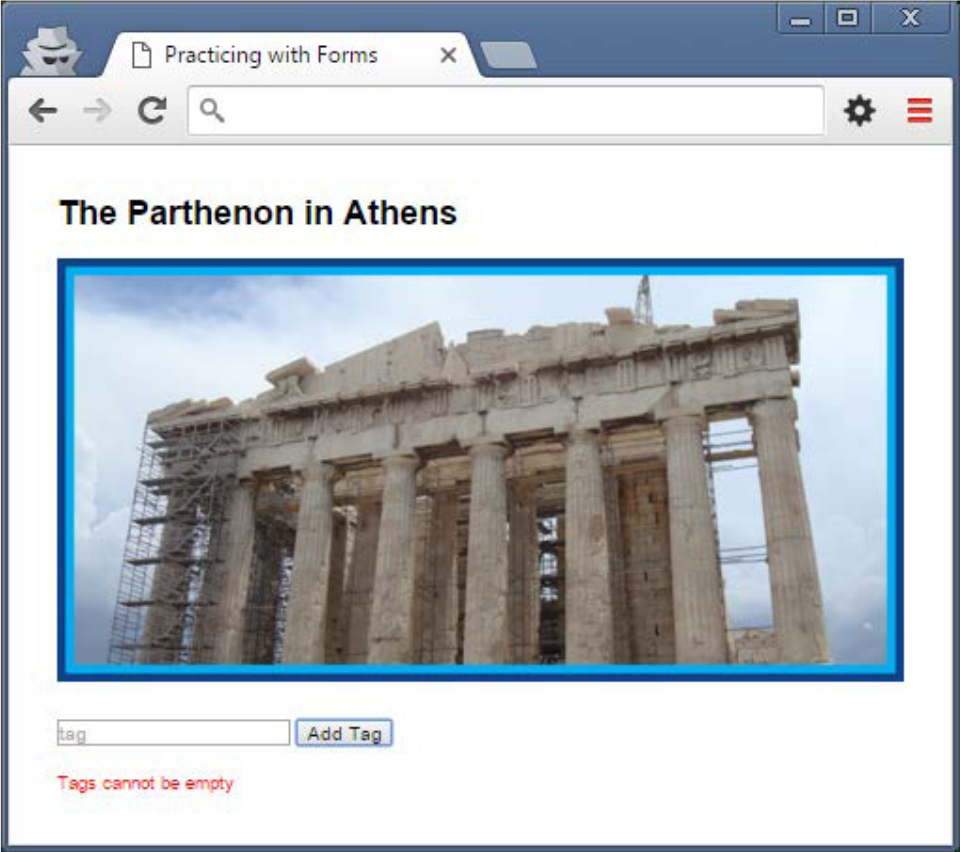
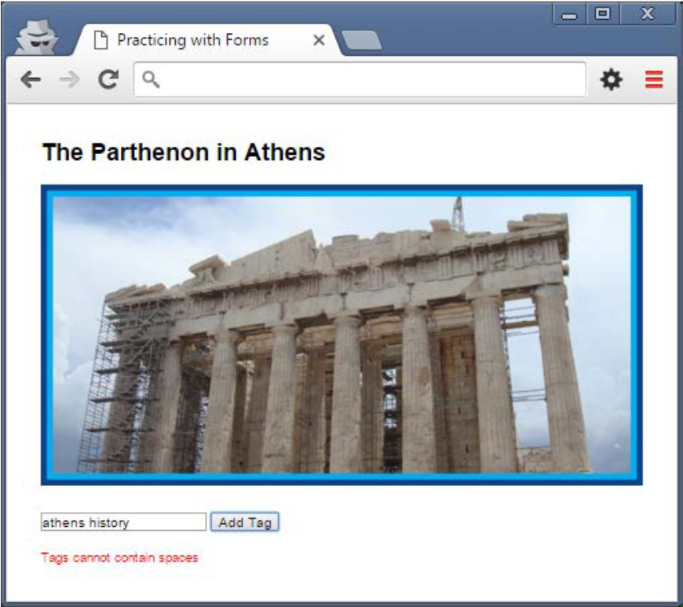

# In Class Exercise 3 - Decisions and Forms [5%]

Using what you have learned in class and through the exercise, make the following updates to your solution:

1. The work you completed in the previous exercise still has a few holes in it. For example, when you enter a multiple word tag (e.g. athens history) all words will be added but only the first will have the ‘#’ before it. Update your solution so that it rejects tag values of more than one word and displays the message Tags cannot contain spaces. This will require you to rethink how error messages are currently being displayed. Show your instructor once you are done.

Please submit the link to your repository to the assessment when you are complete.

Figure 1. No empty tags

Figure 2. No spaces in tag name
